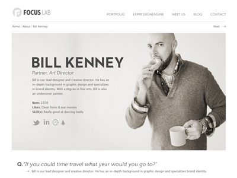
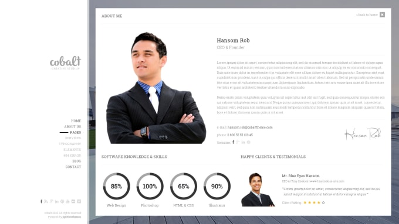
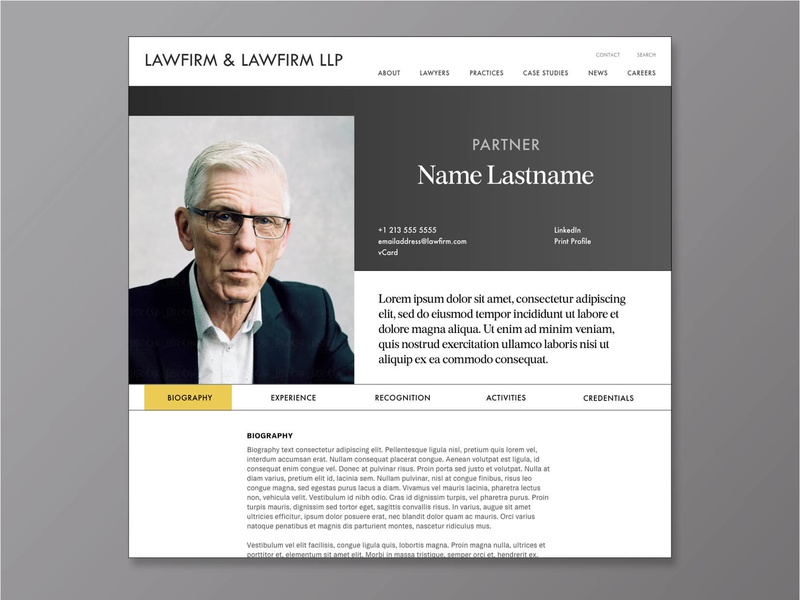
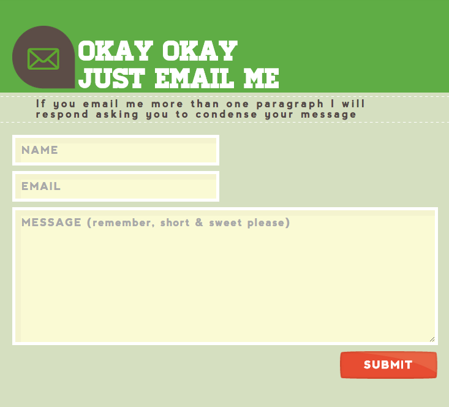
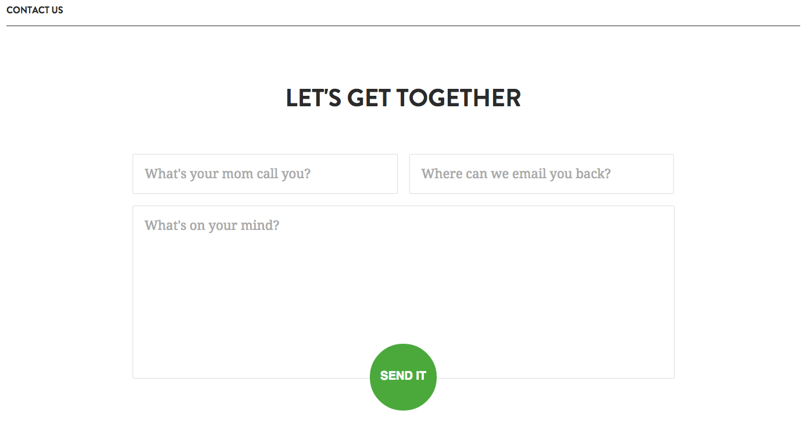
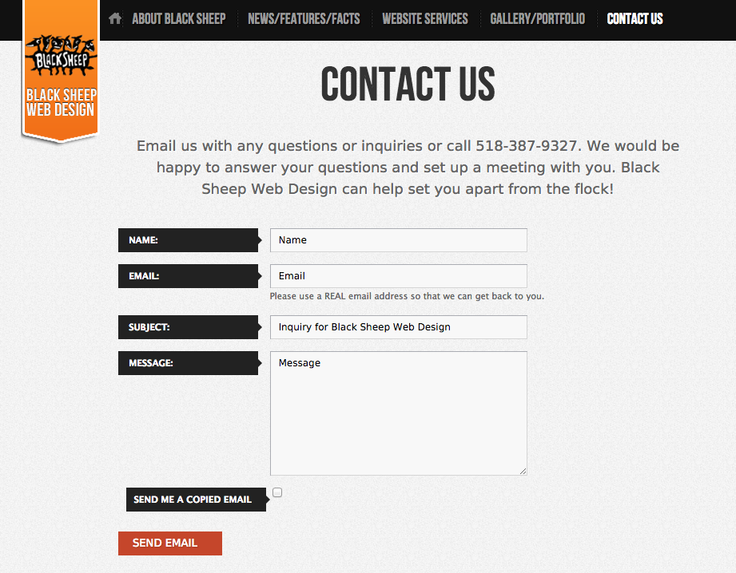
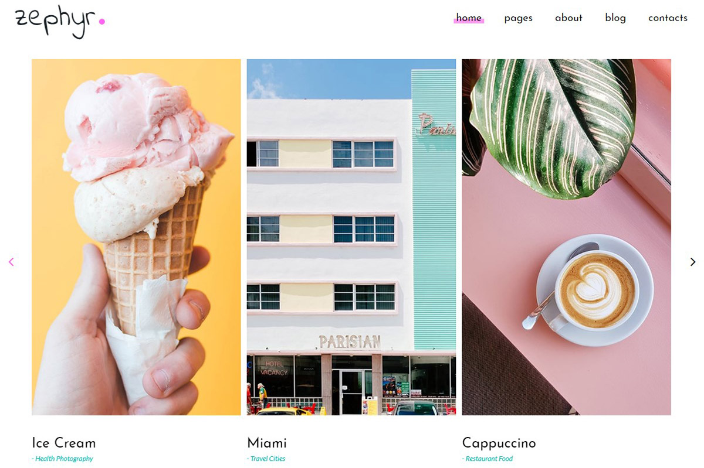
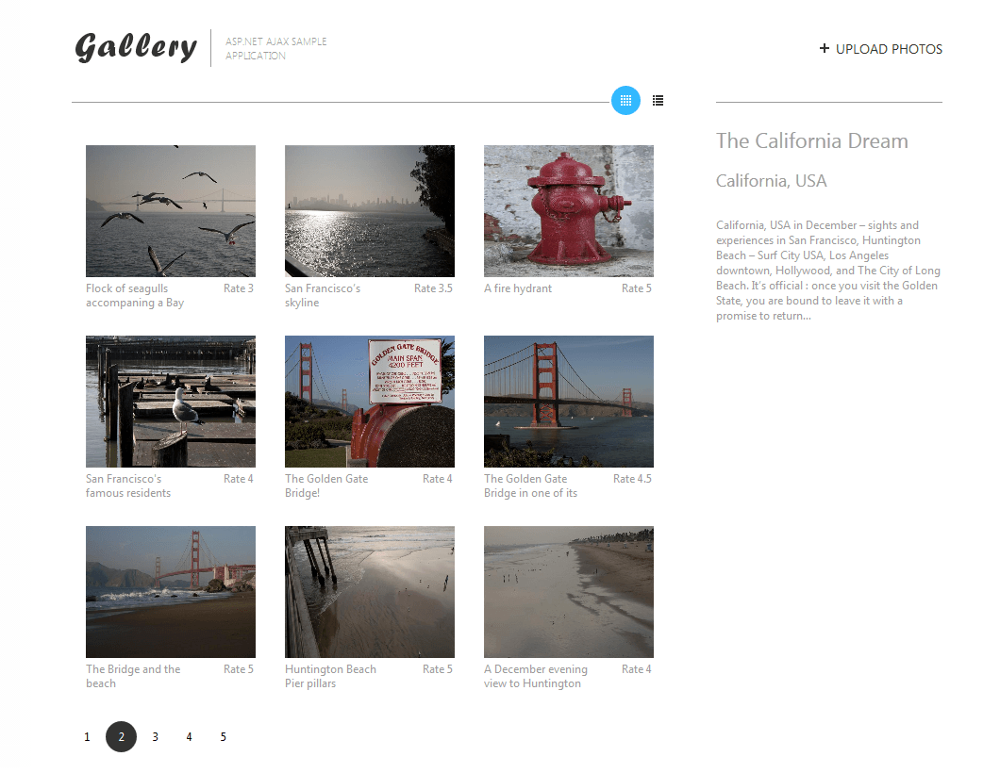
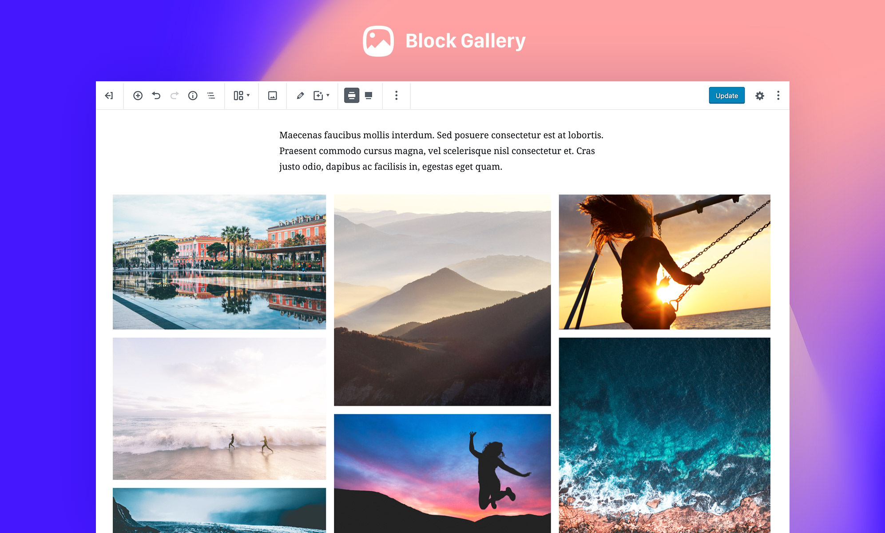

# HTML-CSS
Exercise Objective: Demonstrate an understanding of HTML and CSS.

Duration: 1 day

Exercise Steps/Instructions:

1. Create a Multi-page HTML site about yourself.  Include the following:
      <ul>
      <li>A bio page with 3 to 4 brief sentences, a list of 4 to 6 hobbies, and an image of yourself.</li>
      <li>A gallery page of your favorite collections, can be cars, artists, movies, etc.</li>
      <li>A contact page with a contact form</li>
      <li>Style the appearance of the pages using CSS.  Write your own CSS.  Please do <strong>not</strong> use a component library (Ant Design, Tailwind, Bootstrap, Semantic, etc.)</li>
      <h4>Bonus: </h4>
      <li>Research one new HTML / CSS feature and implement it in your webpage.</li>
      <li>Incorporate some Semantic HTML into your document structure</li>
      </ul>

3. Submit the exercise in <a href="https://bit.ly/3d1Wpvr" target="_blank">TEKsystems Academy</a>

4. Complete the Exercise Evaluation form in <a href="https://bit.ly/2KE32Yw" target="_blank">TEKsystems Academy</a>.

## ********************************
## Git Instructions
- [ ] Create a template copy of this repository by clicking : "Use this template"
- [ ] Name the repository the same name as the master template repository.
- [ ] Add your TA as collaborator
- [ ] Clone YOUR repo to your local computer
- [ ] Create a new branch: git checkout -b `<firstName-lastName>`.
- [ ] Implement the project on your newly created `<firstName-lastName>` branch, committing changes regularly.
- [ ] Push commits: git push origin `<firstName-lastName>`.
## ********************************

Below are some sample design ideas to help spark your creativity.  Feel free to use other designs as well.

Galleries

